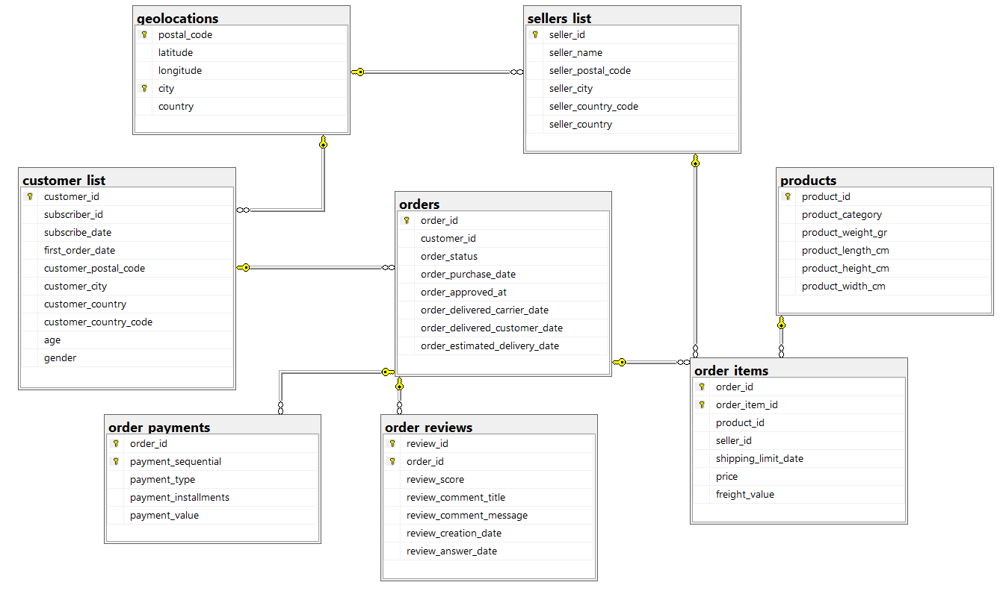

# Fecom-Inc.-Sales-Data-Analysis

## Project Background
Fecom Inc. is a fictional e-commerce marketplace company based in Berlin, Germany. Between 2022 and 2024, it recorded 99,441 orders from 102,727 unique customers and tracked all commercial transactions of 3,095 sellers. This dataset contains commercial data across 338 cities in 28 countries and includes various details about customers and orders, allowing for CRM, sales opportunity, or marketing analysis. The data includes order dates, delivery dates, cart values, shipping costs, order reviews and ratings, payment methods and much more. Since the marketplace is not limited to a specific product, it features 32,951 distinct products across 72 different categories.This project analyzes the available data to gain insight into Fecom Inc.’s performance and includes critical insights that will contribute to the company’s improvement.

Insights and recommendations are provided on the following key areas: 
- 📊 **Sales Trends Analysis**: Evaluation of historical sales patterns, focusing on Revenue, Month Over Month Change, Moving Averages, and 6-Month Revenue Forecast.
- 📦 **Product Level Performance**: An analysis of Fecom Inc's various product lines, understanding their impact on sales and returns.
- 💳 **Loyalty Program Success**: An assessment of the loyalty program on customer retention and sales.
- 🌍 **Regional Comparisons**: An evaluation of sales and orders by region.

An Interactive Power BI dashboard can be downloaded [here](https://drive.google.com/drive/folders/1zOMeSxpi79LqGce3ZOB6tDb-YG1m_edx?usp=sharing).

🗃️ Database Schema: market_place_orders
This project contains a relational database schema that models customer and order data from an e-commerce platform. The schema is built on SQL Server and consists of eight main tables along with their relationships.

🔧 Tables and Descriptions
1. geolocations
Stores geographical information based on city and postal code.
Primary Key: Composite key (postal_code, city)
Other fields: latitude, longitude, country

2. customer_list
Contains personal and demographic information about registered customers.
Primary Key: customer_id
Foreign Key: customer_postal_code, customer_city → geolocations

3. sellers_list
Contains information about sellers on the platform.
Primary Key: seller_id
Foreign Key: seller_postal_code, seller_city → geolocations

4. products
Stores information about the products sold.
Primary Key: product_id

5. orders
Each record represents a customer order.
Primary Key: order_id
Foreign Key: customer_id → customer_list

6. order_items
Stores details about products included in each order. One order can have multiple items.
Primary Key: Composite key (order_id, order_item_id)
Foreign Keys:
order_id → orders
product_id → products
seller_id → sellers_list

7. order_payments
Includes payment information for each order.
Primary Key: Composite key (order_id, payment_sequential)
Foreign Key: order_id → orders

8. order_reviews
Contains customer reviews and ratings for each order.
Primary Key: Composite key (review_id, order_id)
Foreign Key: order_id → orders

🔧 Data Preparation
Initial data cleaning and preprocessing were performed in Excel to ensure data consistency and readiness for analysis.

Cleaned datasets were imported into SQL Server, where they were organized into separate tables with appropriate relationships.

📥 Data Import
CSV files are imported into SQL Server using BULK INSERT statements. File paths refer to the data_analysis\market_place_orders\ directory within the project. The scripts use the UTF-8 character set and specify appropriate FIELDTERMINATOR values per file

## Important Note:
The dataset description says there are 102,727 unique customers. However, when the customer_list csv file was examined, it was seen that there were 99,441 unique customers and the customer_ids of the rest were empty. In addition, this data was removed from the dataset cluster because it did not match any table.

## Data Analysis
🧠 SQL-Based Analysis

A variety of business insights were derived using SQL queries on the cleaned datasets. The analysis focused on identifying customer loyalty patterns, measuring seller performance, and evaluating delivery efficiency by comparing estimated and actual delivery times. Additionally, product categories were ranked based on sales and revenue, while the distribution of payment methods was examined to understand customer preferences. The relationship between customer reviews and ratings was also explored, along with return behaviors across categories. Finally, regional revenue distributions were calculated to highlight city-level income contributions. These findings were later visualized in Power BI through interactive dashboards to support data-driven decision-making.
