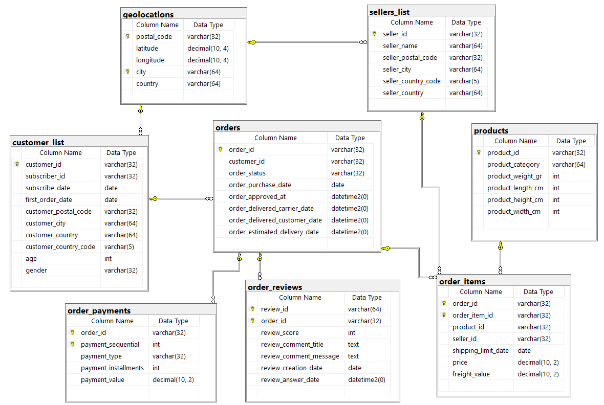
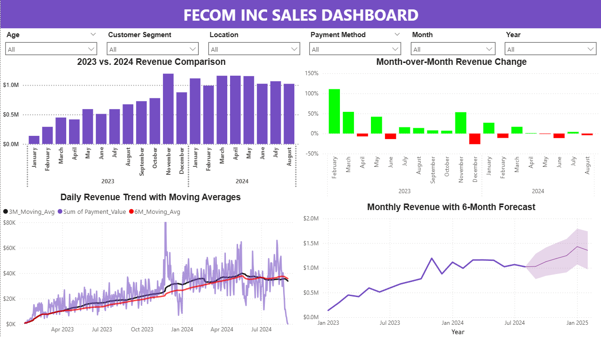

# Fecom-Inc.-Sales-Data-Analysis

## Project Background
Fecom Inc. is a fictional e-commerce marketplace company based in Berlin, Germany. Between 2023 and 2024, it recorded 99,092 orders from 99,092 unique customers and tracked all commercial transactions of 3,068 sellers. This dataset contains commercial data across 265 cities in 27 countries and includes various details about customers and orders, allowing for CRM, sales opportunity, or marketing analysis. The data includes order dates, delivery dates, cart values, shipping costs, order reviews and ratings, payment methods and much more. Since the marketplace is not limited to a specific product, it features 32,787 distinct products across 72 different categories.This project analyzes the available data to gain insight into Fecom Inc.’s performance and includes critical insights that will contribute to the company’s improvement.

Insights and recommendations are provided on the following key areas: 
- 💳 **Customer Demographics and Segmentation**: A detailed breakdown of customer age and gender in relation to revenue, along with a segmentation based on spending behavior to identify high- and low-value customer groups.
- 📦 **Seller and Product Performances**: An analysis of Fecom Inc's various product lines and sellers, understanding their impact on sales and returns.
- 📦 **Payment, Delivery and Review Performance**: An evaluation of transaction values and delivery times to identify patterns, delays, and their impact on customer satisfaction and operational efficiency.
- 📊 **Sales Trends Analysis**: An evaluation of historical sales patterns, focusing on Revenue, Month Over Month Change, Moving Averages.

An Interactive Power BI dashboard can be downloaded [here](https://drive.google.com/drive/folders/1zOMeSxpi79LqGce3ZOB6tDb-YG1m_edx?usp=sharing).

The SQL queries used to prepare and analyze the data can be found [here](https://github.com/fkaya18/Fecom-Inc.-Sales-Data-Analysis/blob/main/fecom_inc_SQLQuery.sql).

## 🗃️ Database Schema
This project contains a relational database schema that models customer and order data from an e-commerce platform. The schema is built on SQL Server and consists of eight main tables along with their relationships.

# Executive Summary

## Overview of Findings

Fecom Inc. demonstrated strong overall performance during the May 2023 to August 2024 period, generating $15.9 million in total revenue from 99,092 orders with an average order value of $160.9. After achieving peak performance in November 2023 (7,544 orders, $1.19M revenue), the company has shown volatile monthly performance with an overall declining trend from the peak levels, with August 2024 recording 6,292 orders and $1.02M revenue. However, year-over-year analysis reveals robust fundamental growth, with August 2024 showing 50.3% increase in orders and 51.6% revenue growth compared to August 2023.

The Power BI dashboard overview page is shown below, and the report has additional examples. You can download the full interactive dashboard [here](https://drive.google.com/drive/folders/1zOMeSxpi79LqGce3ZOB6tDb-YG1m_edx?usp=sharing).

# Customer Demographics and Segmentation

* **Gender Distribution:** The customer base shows a slight male preference with 56.58% male customers (56,070) compared to 43.42% female customers (43,022), indicating broad market appeal across both demographics.

* **Age Demographics:** Prime purchasing demographics dominate the customer base, with the 36-45 age group representing the largest segment at 30.69% (30.4K customers), followed by the 26-35 age group at 21.46% (21.3K customers), collectively representing 52% of the total customer base.

* **Geographic Market Performance:** As a German-based company, Fecom Inc. shows strong performance across European markets with Germany maintaining the largest customer base, followed by France as the second-largest market, with significant presence in Netherlands, Belgium, Austria, and United Kingdom.

* **Customer Segmentation Success:** The tiered customer segmentation strategy demonstrates exceptional effectiveness, with a clear value progression from Bronze customers averaging $41.0 spend to Platinum+ customers reaching $3,384.3 average spend, indicating successful customer lifetime value optimization and upselling capabilities.

* **Conversion Opportunity:** The average time to first order of 72.36 days presents a significant opportunity for conversion funnel optimization to accelerate customer acquisition and reduce the lengthy decision-making cycle.

* **High-Value Customer Profile:** The top spending customer exemplifies the company's premium market positioning, with a 23-year-old male from Paris, France contributing $13,664 in total spending, demonstrating the significant revenue potential from young professional demographics in key European metropolitan markets.

* **Segment Distribution Balance:** Customer distribution across segments shows a healthy pyramid structure with Bronze representing the largest volume (43,588 customers), followed by Silver (28,530 customers) and Gold (4,880 customers), while premium segments (VIP, Platinum, Platinum+) maintain smaller but high-value customer bases totaling 2,239 customers, indicating effective customer journey progression.

* **Gender-Based Revenue Patterns:** Revenue analysis reveals distinct spending patterns across segments and gender, with Gold segment generating the highest total revenue at $6.16M, followed by Silver at $4.2M and VIP at $2.87M, while male customers consistently demonstrate higher spending volumes across most segments, particularly in mid-tier categories.

# Sellers and Product Performance

* **Top Product Performance:* The best-selling products by volume show diverse category representation, with Bed_Bath_Table product (99a4788cb24856965) leading at 488 units sold, while Garden_Tools category dominates the list with 4 out of 7 products, indicating strong customer demand concentration in home and garden segments across different individual products.

* **Seller Revenue Concentration:** GlobalDynamics ($253.37K) and AlphaLabs ($248.76K) lead the marketplace, while emerging sellers like NovaLabs represent untapped growth potential, suggesting opportunities for seller development programs.

* **Category Growth Dynamics:** Health_Beauty shows explosive 140% growth (from $0.6M to $1.44M), while underperforming categories like Cds_Dvds_Musicals and Fashion_Childrens_Clothes indicate strategic optimization needs.

* **Geographic Expansion:** Strong European seller presence with growth opportunities in emerging markets like Sweden, Serbia, Slovenia, and Estonia for market penetration strategies.

* **Profitability Mix:** Premium categories like Computers ($1,182 average) drive profitability, while volume leaders like Bed_Bath_Table (11,107 units) and Health_Beauty (9,619 units) ensure transaction frequency and market penetration

# Key Insights
* **Sustained Growth:** FECOM Inc. has achieved impressive year-over-year revenue growth, approximately doubling revenue when comparing 2023 to 2024, with the first eight months of 2024 already exceeding total 2023 revenue by 20%.
* **Market Maturity:** The slowing month-over-month growth rates in 2024 suggest the company is reaching a more mature market position after rapid expansion in 2023.
* **Stabilization Phase:** Daily and monthly revenue figures in 2024 show a stabilization phase around the $1M monthly revenue mark.
* **Concerning Recent Decline:** The sharp drop visible at the end of the daily revenue chart requires immediate investigation as it could signal the beginning of a significant downturn.
* **Geographic Concentration:** Germany represents FECOM's strongest market by a significant margin, with Berlin generating the highest city-level revenue, followed by other major German urban centers.
* **Product Category Strengths:** Health & Beauty, Watches & Gifts, and home-related categories dominate sales, indicating areas of core competency that could be further leveraged.
* **Customer Demographics:** The 36-45 age bracket generates the highest revenue, with male customers slightly outspending female customers across most age segments.
* **Customer Segmentation Value Analysis:** While the Platinum segment (9.9% of customers) serves as the revenue cornerstone by generating 36.12% of total revenue ($5.76M), the ultra-premium Platinum+ tier delivers exceptional individual value ($3,384.34 per customer) despite its limited collective contribution (2.14%), highlighting the strategic importance of balancing segment-specific growth initiatives with the segment's relative size and stability characteristics.
* **Payment Preferences:** Credit cards dominate payment methods (74.7%), indicating potential opportunities to diversify payment options to attract different customer segments.
* **Delivery Performance:** While 90.5% of orders are delivered on time with high satisfaction (4.29/5), 2.9% of orders are never delivered at all, resulting in extremely low satisfaction scores (1.77/5) and representing a critical service failure point.
* **Customer Service Response Gap:** The slowest customer service response times (2.86 days) are associated with undelivered orders—precisely where faster interventions are most needed to recover customer goodwill.
* **Geographic Market Concentration:** FECOM Inc. demonstrates strong German market dominance with 7 of 8 top-selling companies originating from Germany, likely due to the company's German roots.

# Recommendations
* **Investigate Recent Decline:** Analyze the factors behind the sudden revenue drop in July 2024 to determine if it's a temporary anomaly or the beginning of a trend.
* **Service Response Prioritization:** Restructure customer service protocols to provide fastest response times to undelivered orders, which currently have the slowest response times despite having the most dissatisfied customers.
* **Delivery Process Overhaul:** Conduct end-to-end analysis of delivery processes to address both late deliveries (6.6%) and undelivered orders (2.9%), with focus on tracking system improvements and last-mile delivery partnerships.
* **Geographic Expansion Strategy:** Develop targeted strategies to increase market share in secondary cities beyond the strong German urban centers, focusing on major metropolitan areas in France, Netherlands, and other neighboring countries.
* **Age-Targeted Marketing:** Create specialized marketing campaigns focused on the high-value 36-45 demographic, while developing strategies to increase engagement with younger customers (18-25) for long-term customer base development.
* **Product Category Development:** Leverage strength in Health & Beauty and lifestyle categories while exploring expansion opportunities in underperforming categories like Garden Tools and Auto.
* **Payment Diversification:** Investigate opportunities to expand alternative payment methods beyond credit cards to attract different customer segments or improve conversion rates.
* **Forecast Validation:** Regularly compare actual performance against the forecast projections to refine the model and improve prediction accuracy.
* **Customer Tier Migration Strategy:** Develop targeted programs to elevate Gold customers (24,785 users) to the Platinum tier, as this represents the most promising opportunity for revenue growth.
* **Geographic Diversification Initiative:** Expand seller recruitment in the UK market to diversify the geographic concentration, using CoreLogistics as a successful case study.
* **Segment-Optimized Marketing Framework:** Create separate marketing approaches for volume-based segments (Bronze/Silver) versus value-based segments (Platinum/Platinum+) to optimize resource allocation.

# Assumptions and Caveats
The dataset description claims that there are 102,727 unique customers. However, when the dataset containing customer information was examined, 99441 unique customer ID data entries were found, and the remaining 3286 entries were removed from the dataset because they could not be matched with other datasets. Although the dataset contains sales data between 9/4/2022 and 10/17/2024, in order to obtain logical results while preparing the report, the date was pulled to 1/5/2023 and 8/31/2024 because there were too many missing date ranges, and the comments were made considering only these dates. Similar analyses to those in the reports created using Power BI were also performed in SQL Server, and the Customer_Segment and Payment_Method datasets used were created using SQL Server.
