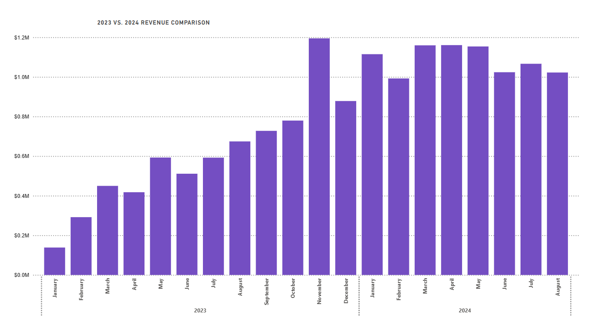
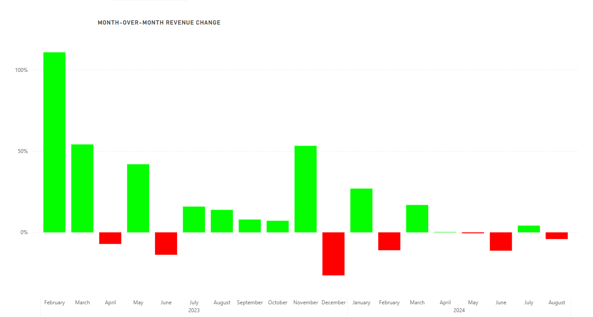
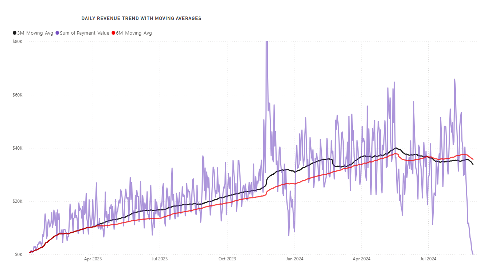
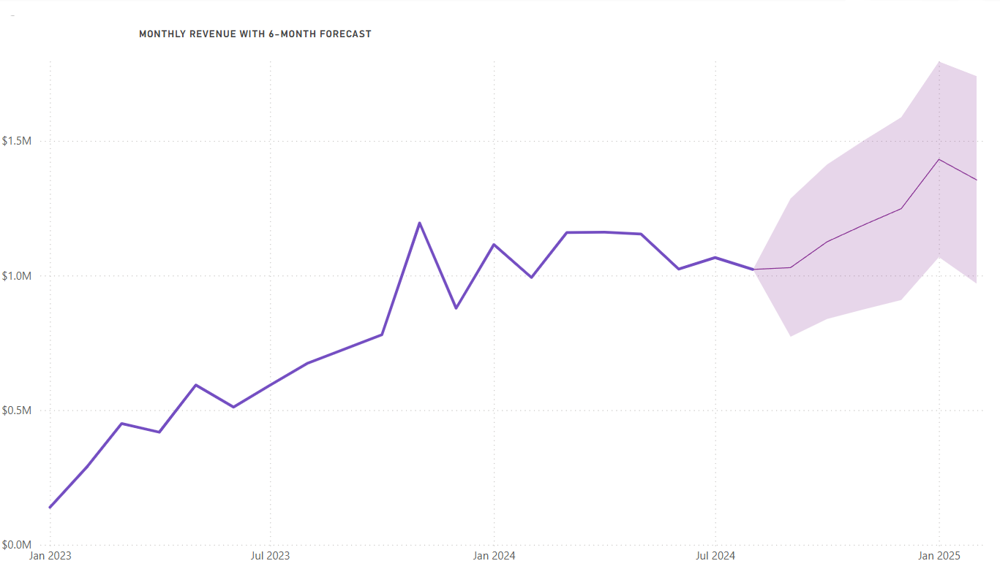
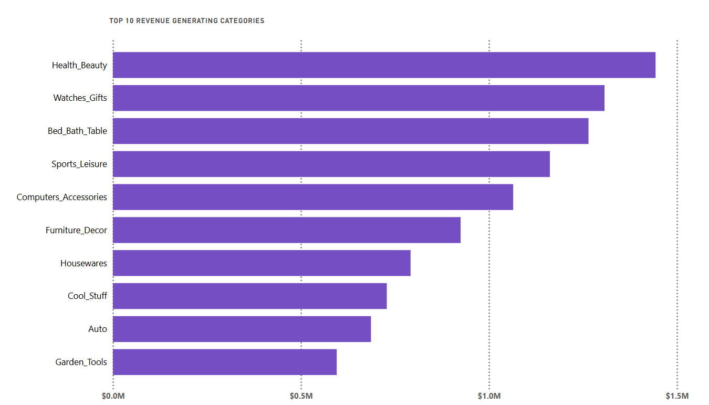
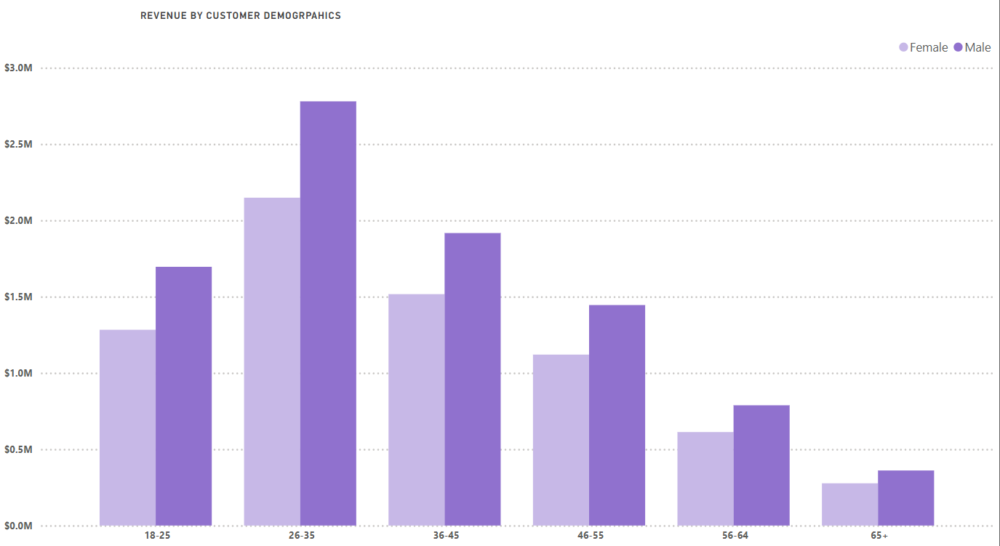
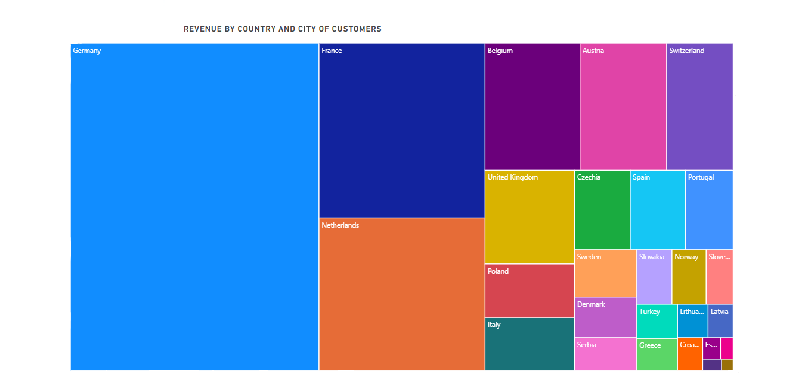
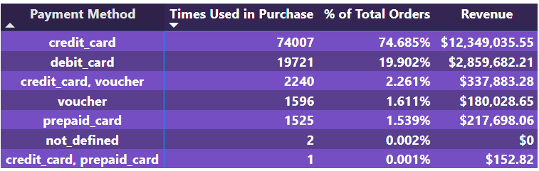
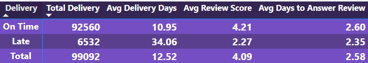

# Fecom-Inc.-Sales-Data-Analysis

## Project Background
Fecom Inc. is a fictional e-commerce marketplace company based in Berlin, Germany. Between 2022 and 2024, it recorded 99,441 orders from 102,727 unique customers and tracked all commercial transactions of 3,095 sellers. This dataset contains commercial data across 338 cities in 28 countries and includes various details about customers and orders, allowing for CRM, sales opportunity, or marketing analysis. The data includes order dates, delivery dates, cart values, shipping costs, order reviews and ratings, payment methods and much more. Since the marketplace is not limited to a specific product, it features 32,951 distinct products across 72 different categories.This project analyzes the available data to gain insight into Fecom Inc.’s performance and includes critical insights that will contribute to the company’s improvement.

Insights and recommendations are provided on the following key areas: 
- 📊 **Sales Trends Analysis**: An evaluation of historical sales patterns, focusing on Revenue, Month Over Month Change, Moving Averages, and 6-Month Revenue Forecast.
- 📦 **Product Level Performance**: An analysis of Fecom Inc's various product lines, understanding their impact on sales and returns.
- 💳 **Customer Demographics**: An analysis of customer income distribution across age groups, gender and country to uncover demographic trends in revenue generation.
- 📦 **Payment and Delivery Performance**: An evaluation of transaction values and delivery times to identify patterns, delays, and their impact on customer satisfaction and operational efficiency.

An Interactive Power BI dashboard can be downloaded [here](https://drive.google.com/drive/folders/1zOMeSxpi79LqGce3ZOB6tDb-YG1m_edx?usp=sharing).

The SQL queries used to prepare and analyze the data can be found [here](https://github.com/fkaya18/Fecom-Inc.-Sales-Data-Analysis/blob/main/fecom_inc_SQLQuery.sql).

## 🗃️ Database Schema
This project contains a relational database schema that models customer and order data from an e-commerce platform. The schema is built on SQL Server and consists of eight main tables along with their relationships.

## Important Note:
The dataset description claims that there are 102,727 unique customers. However, when the customer_list csv file was examined, it was seen that there were 99,441 unique customers and the customer_ids of the rest were empty. In addition, this entries were removed from the dataset because they did not match any table.

# Executive Summary
After a significant growth period through 2023, FECOM Inc. has experienced revenue stabilization with some fluctuations in 2024. The dashboard shows monthly revenue consistently reaching around $1M in 2024, representing substantial growth from early 2023 levels when monthly revenue was below $0.5M. Notably, in just the first eight months of 2024, FECOM Inc. has already generated 20% more revenue than in the entire 2023 fiscal year, highlighting the company's remarkable expansion. The month-over-month revenue changes show volatility, with strong positive growth in early 2023 followed by more modest or occasionally negative growth in 2024, suggesting the company has reached a more mature market position. 

The Power BI dashboard overview page is shown below, and the report has additional examples. You can download the full interactive dashboard [here](https://drive.google.com/drive/folders/1zOMeSxpi79LqGce3ZOB6tDb-YG1m_edx?usp=sharing).

# Sales Trends

## Revenue Comparison (2023 vs. 2024)
In 2023, revenue started around $200K in January and steadily increased throughout the year, reaching approximately $800K by December. In comparison, 2024 shows consistently higher revenue, maintaining levels between $900K and $1.1M across all months, representing approximately a 100% increase from the previous year's corresponding months.

## Month-over-Month Revenue Change
Early 2023 saw exceptional momentum with growth exceeding 100% in February, followed by consistently positive but gradually decreasing growth rates as the year progressed. By late 2023, this momentum began to slow, with November-December 2023 recording negative growth. The pattern continued into 2024, where the company experienced more modest growth percentages and occasional slight declines, clearly signaling a transition from rapid expansion to market stabilization as the business matured and established its revenue baseline.

## Daily Revenue Trend with Moving Averages
The trend shows a clear upward trend from early 2023 through early 2024, with revenue spikes becoming more pronounced and reaching as high as $180K on peak in November 24th. Both the 3-month and 6-month moving averages demonstrate steady growth throughout 2023, eventually stabilizing around $35-40K daily revenue in 2024. However, a concerning sharp decline is visible at the end of the reporting period in July 2024, warranting immediate investigation to determine whether this represents a temporary anomaly or the beginning of a more significant downturn in business performance.

## Monthly Revenue with 6-Month Forecast
The monthly revenue forecast model projects continued positive growth for FECOM over the next six months, with revenue potentially reaching approximately $1.5M by early 2025. This optimistic outlook is tempered by the widening confidence interval (shown as a purple shaded area) that expands significantly toward the end of the forecast period, indicating increasing uncertainty in these projections as they extend further into the future. Despite recent fluctuations in monthly performance, the overall trajectory suggests the company has potential for continued growth, though leadership should closely monitor performance against these projections to validate the forecast model and adjust strategies accordingly as new data becomes available.

# Product and Seller Performance

## Top 10 Categories Generating Highest Revenue
Among the product categories that generate the most revenue, the Health & Beauty category is seen to lead in sales performance, followed closely by Watches & Gifts and Bed, Bath & Tableware, with these three categories accounting for 20% of the total revenue.The top 10 categories form a well-balanced portfolio with Health & Beauty generating approximately $1.5M, followed by six categories each contributing between $0.8M-$1.2M (Watches & Gifts, Bed & Bath, Sports & Leisure, Computers & Accessories, Furniture & Decor, and Housewares). The remaining categories (Cool Stuff, Auto, and Garden Tools) each contribute between $0.3M-$0.7M. This distribution suggests FECOM Inc. has successfully diversified its product offerings while maintaining strong performance in health, lifestyle, and home-related categories, which appear to be its core strength areas.

## Top Revenue Generating Sellers
Eight companies have generated over $200K in sales, with GlobalDynamics leading at approximately $250K followed closely by AlphaLabs. The concentration of German sellers (7 out of 8 top performers) reflects FECOM Inc.'s German origins, creating a natural advantage for local sellers, while CoreLogistics stands out as the only UK-based company breaking into this elite group. These top performers represent just 0.26% of the total 3,095 seller base, highlighting both the competitive marketplace and the significant revenue potential for those who excel on the platform.

# Customer Demographics and Segmentation

## Revenue by Customer Age and Gender
Revenue analysis by customer demographics reveals that the 36-45 age group generates the highest revenue at approximately $3M, making them FECOM Inc's most valuable customer segment. The 26-35 and 46-55 age groups follow as the second and third highest-performing segments respectively, each generating approximately $2M in revenue. Male customers appear to generate slightly higher revenue than female customers across most age brackets, with the most pronounced difference visible in the peak 36-45 segment.

## Revenue by Customer Country and City
Germany, FECOM Inc.'s home market, predictably dominates sales with Berlin generating the highest revenue, followed by multiple strong-performing German cities including Hamburg, Munich, Cologne, Frankfurt, and Stuttgart. This multi-city strength demonstrates FECOM's deep domestic market penetration. Outside Germany, major European capitals and commercial hubs drive performance, with Paris (France) and Amsterdam (Netherlands) emerging as particularly strong international markets. The treemap visualization showcases a classic Central European expansion pattern, with concentric circles of influence radiating from German urban centers to major cities in bordering countries (Paris, Amsterdam, Antwerp, Vienna, Zurich) and then to urban centers in the broader European region (London, Warsaw, Oslo, Copenhagen). This city-focused distribution highlights FECOM's effective urban-centric marketing strategy that prioritizes metropolitan areas with higher population density and stronger e-commerce adoption rates across the Central European economic zone.

## Monthly Revenue by Customer Segment
With customers segmented based on spending percentiles, Platinum+ customers (top 0.1%) consistently generate the highest revenue, showing significant growth from around $60K to peaks exceeding $440K in late 2023 and early 2024, though with notable volatility. The middle segments (Platinum, VIP, and Gold) show more stable growth trajectories between $100K-$250K, while Silver and Bronze segments (representing the bottom 50% of customers) contribute relatively smaller but steady revenue streams below $100K. All segments show overall growth since January 2023, with seasonal fluctuations visible across the entire customer base.

## Segment-Level Revenue Performance Overview
FECOM Inc. serves 99,092 customers across six spending segments, with revenue distribution revealing clear strategic priorities. Platinum customers, though comprising only 9.9% of the customer base (9,793 individuals), drive the company's financial performance by generating 36.12% of total revenue ($5.76M) with an average spend of $588.10 each. Gold and VIP segments each contribute approximately 21% of total revenue ($3.4M) despite their different sizes (24,785 Gold customers versus 14,864 VIP customers), while Silver and Bronze tiers contain roughly 25% of customers each but contribute disproportionately less (12.70% and 6.67% respectively). The elite Platinum+ segment, representing just 101 ultra-premium customers (0.1%), generates only 2.14% of total revenue despite an impressive average spend of $3,384.34 per customer, demonstrating that while these top spenders have high individual value, their small number limits their aggregate contribution compared to the broader Platinum tier.

# Payment and Delivery Performance

## Payment Method
Payment method analysis shows an overwhelming preference for credit cards, which account for 74.7% of transactions ($12.35M), while debit cards represent nearly 20% of orders ($2.86M). Alternative payment methods including vouchers and prepaid cards collectively represent only about 5% of transactions.

## Delivery Situations and Their Reflect on Review Score
The delivery performance metrics reveal significant operational efficiency challenges across three delivery status categories. On-time deliveries account for 89,672 orders (90.5%) with an average delivery time of 10.95 days and nearly excellent customer satisfaction (4.29/5 average review score). However, 6,532 orders (6.6%) were delivered late with a significantly longer average delivery time of 34.06 days and much lower customer satisfaction (2.27/5 average review score). Most concerning, 2,888 orders (2.9%) were never delivered at all, resulting in the lowest customer satisfaction score (1.77/5). This three-tiered outcome clearly demonstrates how delivery performance directly impacts customer experience. The data shows FECOM's customer service responsiveness varies slightly by delivery outcome: on-time orders receive review responses in 2.59 days, late deliveries in 2.35 days, and undelivered orders take the longest at 2.86 days. The faster response time for late deliveries suggests prioritization protocols for addressing customer concerns about delays, but the slower response to undelivered orders—which have the most dissatisfied customers—represents a critical service gap that requires immediate attention.

## Data Analysis
🧠 SQL-Based Analysis

A variety of business insights were derived using SQL queries on the cleaned datasets. The analysis focused on identifying customer loyalty patterns, measuring seller performance, and evaluating delivery efficiency by comparing estimated and actual delivery times. Additionally, product categories were ranked based on sales and revenue, while the distribution of payment methods was examined to understand customer preferences. The relationship between customer reviews and ratings was also explored, along with return behaviors across categories. Finally, regional revenue distributions were calculated to highlight city-level income contributions. These findings were later visualized in Power BI through interactive dashboards to support data-driven decision-making.
